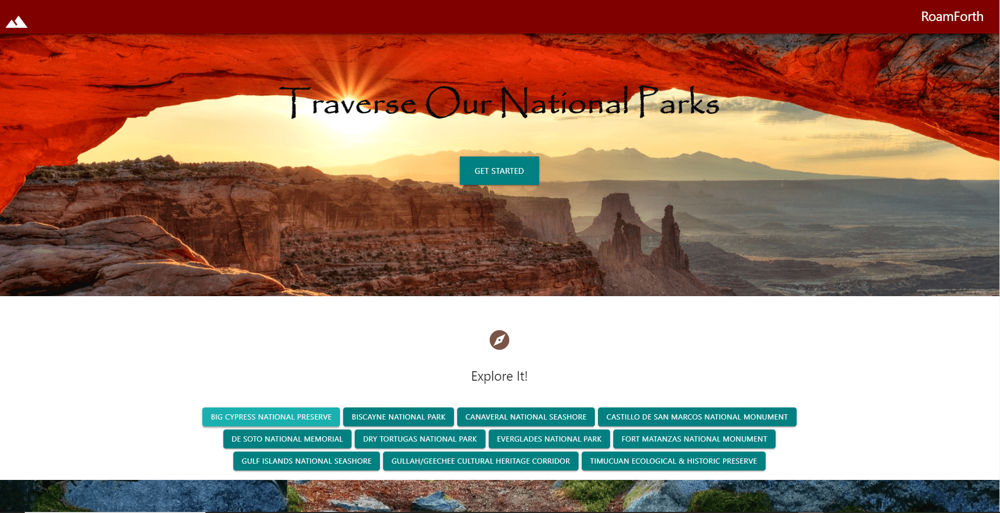

## RoamForth

This application is for users looking to go on an adventure in a national park.

# Functionality:

When the application loads the user is given an option to get started. Once the user clicks the get started button, a modal pops up to let the user choose which state they would like to explore. After the state selection, the user can choose a national park to load. When the national park is selected, it will display information about the park, images(when available), and activities. The user can visit the parks official page in the information section. If the user decides to visit this park, they have the option to get directions to the park towards the bottom of the page.

# Sources: 

[]
[]
[]
[]
[]

Visual Studio Code (https://code.visualstudio.com/)
Materialize CSS Framework (https://materializecss.com/)
MapQuest API (https://developer.mapquest.com/)
National Parks Service API (https://www.nps.gov/subjects/developer/api-documentation.htm)

# Images

